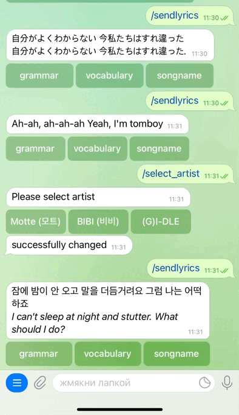
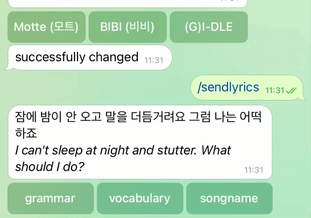
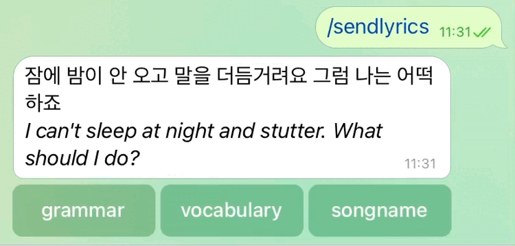
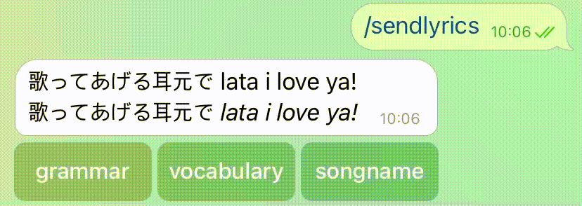

## Korean lyrics bot ##

This bot will send you lyrics from korean songs everyday! 
You can explore grammar, vocabulary and ask for the name of the song.

An example of a bot message:

Here there are 3 buttons:
- grammar 
- vocabulary
- song name

### Grammar ###
By clicking on the grammar button the buttons will be changed to the buttons with korean grammar. If you click on one of them the bot will send you a message with some information about grammar - definition, examples of usage

### Vocabulary ###
If you click on vocabulary button, this bot will show you the buttons with korean words from this text. By clicking on the word you can get the translation of it.

## song name ##
You can also ask bot to tell you the name of the song. Just simply click on the "song name" button and it will send you the message with information.

This bot filters lyrics and exclude those, where there are only english words, but he can't do the same with japaneese lyrics( However, you still can click on the buttons and bot will just show you that there is no grammar or vocabulary. 

## change artist ##
Also you can change the artist (by default - (G)I-DLE). Send him "/select_artist" command and then select from the list. However, there is no opportunity to add your own artist :(

